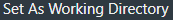
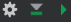
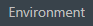
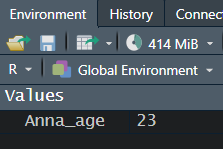

```{r setup, include=FALSE}

knitr::opts_chunk$set(echo = TRUE)
```

\

# *<span style="text-decoration:underline">How do I start?</span>*
\

## Instalation
\


* First, you need to download R through one of the mirrors [*here*](https://cran.r-project.org/mirrors.html) or directly use the Polish mirror [*here*](https://cran.mi2.ai)

\


\

* Now, we need to install IDE (integrated development environment) allowing us to send prompts to the computer, thus activating our code. That IDE in our case is _RStudio_, the most popular choice for handling R code. You can click [*here*](https://posit.co/download/rstudio-desktop/) to download RStudio for your operating system.
\
  + RStudio can also be run online via [RStudio Cloud](https://rstudio.cloud/), although it's a paid service
  + You can also use an online sandbox service, although keep in mind that it will make your data public, so you should avoid that if the data belongs to a company, is supposed to be patented or simply is private to you.
\
* IDE alternatives to RStudio: [Visual Studio Code](https://code.visualstudio.com), [RKWard](https://rkward.kde.org)

\
\

***

## Understanding RStudio
\

* RStudio looks like a bunch of programs fused into one - hence you'll have to get used to operating on its 4 different sections. For your convenience, a figure below explains what are those sections for.

\


\

***

## Setting up your workspace
\

* First, we need to adjust RStudio to our needs. To do so, find Global Options and check what options are adjustable. Keep in mind that everyone has different preferences, hence you need to find what works best for you!

\


\

* Now you can see General Options, which are the most crucial. 
\

  + Here you can decide on where all your edited files should be saved to, unless otherwise stated (like inside a Project - we'll go over them in minute!) - this is called a working directory, so a specified path you work in. <br> Further, you can decide whether the files you worked on last time you opened RStudio should reopen again for your convenience, or do you rather want to control it yourself!

  + Next General Option is quite important for those who tend to forget about saving their files! You can make RStudio save files for you by clicking 'Save workspace to .RData on exit:' on either 'Ask' or 'Always' (as Snape used to say)  

\


\

* Another interesting thing you can adjust is how is the code presented in the console, so in that left-down corner of RStudio. 
  + For your convenience, it's possible to keep the code highlighted with colors, same as in the Code Editor window (left-up corner of RStudio).
  + You can also decide on whether the error messages should be displayed in a different color (to allow you to spot them easily) or not.
  + Another thing to change is limiting the output length. This is useful while working with huge sets of data. Think about it - if you had a data set from clinical trials, you'd have data on thousands of patients. If you were to open that data set for analysis in R with a command, the output in the console would not only be unreadable, but also would take a lot of time. Hence, you can decide on limiting the output length to for example 1000. This way, if you load a data set as a table and open it in the console, it will only print the result up until the 1000th line/row in the table. This can save you time in the future!

\


\

* Appearance changes are not a necessity, *<span style="text-decoration:underline">but are something I very much recommend you to adjust!</span>* <br> I myself prefer dark modes, with colors allowing me to easily distinguish the most important elements of the code. <br> You can also decide on the font type as well as size! The latter can be useful when you're discussing your code in an online meeting and want your audience to focus on the code!

\


\

* Last, but not least, you can adjust __RMarkdown__ settings! 
  + RMarkdown (.Rmd) is a complex file type with text-based formatting, allowing the storage of the code in so called executable chunks and its comments, descriptions, outside, as a code that is not meant to be activated. 
  + RMarkdown files enable us to create dynamic documents with R. 
  + *<span style="text-decoration:underline">This page was first prepared as an RMarkdown file and later converted to HTML!</span>* 
  + R allows such conversion to .pdf or .docx as well, so R can allow you to create your student assignments in a great style!
  


***
\

## Creating your first project
\

* First thing you need to do is set up a new project now. Treat a project as your organisational unit for the Project you work on - keep every file related to that project there! For example, if you wanted to create an R program, you could create a project to store the executable .R file, together with the .Rmd file, providing more insights into the work.
* This seems like a boring necessity now - you might feel the urge of skipping this part. Find the power within you to oppose that feeling!

\


<div class = "row">
  
<div class = "col-md-6">

</div>
  
<div class = "col-md-6">
Being in a project helps you to be more organised! It'll help you avoid loosing your files. If you earlier set Global Options to save your workspace after closing, your project will be updated automatically!
</div>
</div>

\

<div class = "row">
  
<div class = "col-md-8">

</div>

<div class = "col-md-4">

This might be more important when you're more comfortable with R! 
\
Not only can you create a project out of already existing directory, but also start a GitHub-related project - this might be useful if you wanted to create a small website with R! 
\
You could link your project to a repository in GitHub and further render your RMarkdown file into HTML and publish it! 
\
*<span style="text-decoration:underline">Just as the site you see right now!</span>*
</div>
</div>

\
\
<div class = "row">
  
<div class = "col-md-8">


</div>
<div class = "col-md-4">
If you were to link your project to GitHub, next window you'd see would be asking you to put the link and the name of the repository related to this project. This allows you not only to have an online copy of your work, but also to create your GitHub Pages site.

</div>
</div>

\
\


## Setting up your working directory
\

Similarly to a project, **a working directory** is a must-have! It is the place where you'll store all your files during your wok. Files will be created and saved in that specified path.

\
Do not use basic directories, like *'Documents'* or *'Downloads'*!! This creates a mess and makes finding your files difficult.

\
Beware of opening files from a different directory than the one you work with! If the names are similar, you might get confused and overwrite the wrong file!

\

Create a new directory/folder. You can do so in Files section with clicking the icon . Open it and set as  working directory. First find  icon, click on it and further choose .

\
\

## Creating your first file
\

> _Formats to choose from_

Click on the formats below to understand what will suit your work best.


<html>
<head>
<meta name="viewport" content="width=device-width, initial-scale=1">
<style>
.collapsible {
  background-color: #073973;
  color: #ffffff;
  cursor: pointer;
  padding: 18px;
  width: 100%;
  border: none;
  text-align: left;
  outline: none;
  font-size: 15px;
}

.active, .collapsible:hover {
  background-color: #073973;
}

.content {
  padding: 0 18px;
  max-height: 0;
  overflow: hidden;
  transition: max-height 0.2s ease-out;
  background-color: #2074d4;
}
</style>
</head>
<body>


<button class="collapsible">R Script [ .R ]</button>
<div class="content">
  <p>  
  \
  _Most suitable for scripting. It is the simplest format and its lines are all read when the file is activated._</p>
</div>
<button class="collapsible">R Markdown  [ .Rmd ]            ---*__Recommended option!__*</button>
<div class="content">
  <p>
  \
  _R Markdown allows you to put both the code and its explanation in 1 file. It introduces so called chunks, parts of the file specifically for the code. This means whatever you put inside, will be activated and processed. _
  \
  _Outside chunks you can write your comments in an elegant way, decide on the look of the titles, define whether you want the text **highlighted** *in a manner that* *<span style="text-decoration:underline">suits you best!</span>*. _
  \
  _When you gain more experience, you'll be able to create interactive reports in R, with graphs, tables and other data attached._
  \
  \
  _Additionally, R Markdown allows you to include scripts written in other languages than R - for example in JavaScript, Python or SQL! This means you can add interactive buttons (like the one you just clicked to see this definition!),  create a database or include a small program/game on your site. _
  \
  _R Markdown is a format allowing you to create basic websites, by translating your file to HTML. This allows you to get into Web Development without the need to understand the basics of HTML and CSS._
  </p>
</div>
<button class="collapsible">R Notebook [ also .Rmd ]</button>
<div class="content">
  <p>
  \
  _Every R Notebook is an R Markdown file - and the two are almost identical. However, R Notebook allows you to check how your file looks, without the need to save it to HTML/DOC/PDF._
  \
  _Whereas R Markdown has a **Knit** button allowing to save the file with a new extension (.html, .doc, .pdf), R Notebook additionally has a **Preview** option, allowing you to check the output before saving._</p>
</div>

<button class="collapsible">R Sweave [ .Rnw ]</button>
<div class="content">
  <p>
  \
  _Framework for LaTeX + R, for automatic report generation. Not only are the Sweave reports dynamic, but also can update themselves automatically. _
  \
  _More on that file type [**here**](https://rpubs.com/YaRrr/SweaveIntro), [**here**](https://ds.dfci.harvard.edu/~aedin/courses/ReproducibleResearch/Workshop-reproducible-research_pgf.pdf) and [**there**](https://journal.r-project.org/news/RN-2002-3-sweave-part-i-mixing-r-and-l/RN-2002-3-sweave-part-i-mixing-r-and-l.pdf). _
</p>
</div>

<button class="collapsible">R Shiny </button>
<div class="content">
  <p>
  \
  _Powerful package (more on them soon!) for web app development without requiring HTML, CSS or JavaScript knowledge. If you want to create interactive graphs with multiple filter arguments this is the best way to do that!_
  \
  _Best tutorial on Shiny is available [**here**](https://shiny.posit.co/r/getstarted/shiny-basics/lesson1/index.html)._
</p>
</div>
<script>
var coll = document.getElementsByClassName("collapsible");
var i;

for (i = 0; i < coll.length; i++) {
  coll[i].addEventListener("click", function() {
    this.classList.toggle("active");
    var content = this.nextElementSibling;
    if (content.style.maxHeight){
      content.style.maxHeight = null;
    } else {
      content.style.maxHeight = content.scrollHeight + "px";
    } 
  });
}
</script>

</body>
</html>

\
During our classes I advise you to use _R Markdown files_, as they are enabling us to be precise which part of the file is text and which is code. 
\
Also, this type of files allows you further translation of the file to HTML, DOC or PDF, which means you can easily learn how to make nice-looking reports on anything you like! Whether it's job, university or hobby -related!


***


# *<span style="text-decoration:underline">Let's code!</span>*
\

## Activate the code 
\

The easiest, fastest and most recommended method to do that is using **a key shortcut**:

<html>
<head>
<style>
.button {
  background-color: #073973;
  border: none;
  color: white;
  padding: 15px 32px;
  text-decoration: none;
  display: block;
  font-size: 16px;
  margin: 4px 2px;
  cursor: pointer;
}
</style>
</head>
<body>


<button class="button">Ctrl</button> \+ <button class="button">Enter</button>

</body>
</html>


\

The combination of these two will result in the activation of either a line in which we currently write or of a specific selection we choose (highlight).

\
\
Additional options:
\

* You can use the **Console** (left-down part of RStudio) to write prompts directly or to paste code written beforehand in a file.
+ If you're using .Rmd (R Markdown/Notebook) files with executable code **chunks**, you can find the **green triangle icon** to click on in the **right-up corner of the chunk**  , if you want **all the code in the chunk to be activated**. This will however **<span style="text-decoration:underline">print the result of the code right at the end of the activated chunk! </span>** To change that, click on  right next to  in the Code Editor section and choose . If you however want to see the output right under the activated chunk, click .
+ Select the line of code in the Code Editor, being in your file. Find  **button** and click on it. You'll see the effect in the Console.

\

Let's try and activate our first line of code! The easiest thing we can ask the computer to calculate for us is a sum of two numbers. 
Below, in the first line you can see what you need to write (5 + 13) and in the next line, with '## [1]' prefix you see the result of that calculation.


```{r, eval=TRUE}
5 + 13
```

\

***

## Exercise 1

\
Given that you already made a project, defined a working directory and created your first .Rmd file, you're ready to start your notes!
\

Now copy the code from the white space below to your first chunk in the .Rmd file and activate it to see how to perform basic arithmetic tasks in R.
To add a new chunk use a shortcut Alt+Ctrl+I.
\

Remember R respects the order of math equations, hence sometimes parenthesis might be necessary. Define whether the last 2 equations have the same output and write the answer outside the chunk, as a text.


```{r artithmetic, eval=FALSE}

5 + 13

24 - 8

24^2

24*2

35/5

6+3/3

(6+3)/3

```

\

***

Let's take a look at the last equation again.
```{r, eval=FALSE}
(6+3)/3
```

Let's suppose you have 9 candies in your backpack and you're taking a walk with your 2 friends. You've decided you do not feel like eating sugar and gave one friend 6 candies, and 3 to the other.
\
Now with this setting, our equation allows us to count the mean amount of candies you and your 2 friends had.
\
However, with the amount of candies to give, comes the amount of numbers we'd need to add to our equation. Instead, to make it easier for each time we would need to count the mean, we could define a set of rules and clarifications allowing the computer to understand what a mean actually is. This way, the next time we'd need the mean, we'd only have to provide a list of numbers of candies, and computer will evaluate how many numbers we provided and what is its sum, by itself.

This is exemplified by the code below, where we define that one person got 6 candies, 2nd person 3 and the third (ourselves) - 0 :

```{r, eval=TRUE}
mean(c(6,3,0))
```

As you can see the output is the same. We'll now focus a bit more on functions and just how much they improve our coding experience.

\

***

\


## Functions
\

While summing two numbers together was an easy task to understand for a computer, other jobs might need more explanation. 
\

Functions are containing such sets of rules and clarifications, dividing bigger jobs into smaller parts.
\
\

Click on the button below to view a list of useful arithmetic functions.

\

<html>
<head>
<meta name="viewport" content="width=device-width, initial-scale=1">
<style>
.collapsible2 {
  background-color: #073973;
  color: #ffffff;
  cursor: pointer;
  padding: 18px;
  width: 100%;
  border: none;
  text-align: left;
  outline: none;
  font-size: 15px;
}

.active, .collapsible2:hover {
  background-color: #073973;
}

.content {
  padding: 0 18px;
  max-height: 0;
  overflow: hidden;
  transition: max-height 0.2s ease-out;
  background-color: #2074d4;
}
</style>
</head>
<body>


<button class="collapsible2">Arithmetic functions </button>
<div class="content">

```{r s, eval=FALSE}
min(x)        # minimal value from a given set 'x'
max(x)        # maximum value from a given set 'x'
mean(x)       # the mean value from a given set 'x'
sum(x)        # sum of all (numerical) values from a given set 'x'
sd(x)         # standard deviation from a given set 'x'
var(x)        # variance from a given set 'x' [how different are our data in a given set]
median(x)     # median from a given set 'x'
range(x)      # range of set 'x' 
abs(x)        # absolute value of x [this means that R will bring us distance from 0 to a given value, regardless of the direction - so value '-1.5' will be printed as "1.5" because it's length from 0 on the linear graph is 1.5]
log(x)        # natural logarithm of 'x', where base is 'e'
log(x, base)  # logarithm of 'x' with the base different than 'e'
log10(x)      # logarithm of 'x' with the base 10
sqrt(x)       # square root of 'x'
```
</div>
<button class="collapsible2">Trigonometric functions </button>
<div class="content">
```{r trigonometric functions, eval=FALSE}
cos(x)  # cosinus of x
sin(x)  # sinus of x
tan(x)  # tangens of x
acos(x) # arcus cosinus of x
asin(x) # arcus sinus of x
atan(x) # arcus tangens of x
```
</div>
<button class="collapsible2">Statistical functions </button>
<div class="content">
```{r statistical functions, eval=FALSE}

lm()      # Determine the least-squares regression line
anova()   # Analysis of variance (can use on results of lm())
predict() # Obtain predicted values from linear model
nls()     # Estimate parameters of a nonlinear model
cor(x,y) # Correlation coefficient between contents of x and of y
```
</div>

<button class="collapsible2">Basic functions </button>
<div class="content">
```{r basic functions, eval=FALSE}

setwd()            # set a working directory
getwd()            # "find and show me my working directory"
install.packages() # for installing packages with defined functions
library()          # load the package in order to use it
sessionInfo()      # check what is your R version, what packages are loaded and what are your pc and operatic system specifics
```
</div>
<script>
var coll = document.getElementsByClassName("collapsible2");
var i;

for (i = 0; i < coll.length; i++) {
  coll[i].addEventListener("click", function() {
    this.classList.toggle("active");
    var content = this.nextElementSibling;
    if (content.style.maxHeight){
      content.style.maxHeight = null;
    } else {
      content.style.maxHeight = content.scrollHeight + "px";
    } 
  });
}
</script>

</body>
</html>

\
Let's explore that last section, basic functions.
\

A moment ago, you set a new folder as a working directory, but you could have asked the computer to do that for you! You'd have to divide that into understandable tasks:
\

1. Click on 'More'
2. Click on 'Set As Working Directory'
\

The function to do that was already written by somebody, and is called **setwd()**. 
\
\

Try it out yourself! 
\
First, copy the following snippet to RStudio:

```{r2, eval=FALSE}
setwd("C:/Write-Path-Here")
```

... and paste the path to your new folder inside parenthesis ("").

\

> Make sure the function did its job!
\

In Files Tab again, find  icon, click on it and further choose .
\

OR you can use a dedicated function instead:
\

```{r getwd, eval=FALSE}
getwd()
```

You might've noticed that each of the functions we discussed had parenthesis () present. Keep that in mind.
\
\

If you find a phrase or function you don't understand, it's best to put a question mark on the left, select the whole phrase with it and activate the code. The explanation will appear in the 'Help' section of RStudio (right-down window).

```{r help, eval=FALSE}

?help
?download.file()
```


If you don't know the specific name of a given function you want to use but know what it's supposed to be doing, you can use **help.search("")**
```{r}
help.search("download")
help.search("graphs")
```

These functions are all installed automatically with R, but as you might imagine, they cannot meet the expectations of each and every user.
\
That's why people started writing their own functions - and luckily many of them release it later for free!
\
Such a set of user-defined functions available for download is called a **package**.
\
Let's briefly discuss them before we go any further.

\
\

***
\

## Packages

To check what kind of **packages** you have installed and loaded onto your current R session, you can use:
```{r packages1, eval=FALSE}
sessionInfo()
```
This will also print details on your operating system.

If the package you want to use is not on the list, its functions will not work. Hence, if we wanted to load a package called **tidyverse**, we can execute:
```{r library, eval=FALSE}
library("tidyverse")
```

If you don't have tidyverse installed, you can do it with:
```{r install, eval=FALSE}
install.packages("tidyverse")
```

If you want to browse the Packages you have and might have, you can do so in the Tab 'Packages' (right-down window in RStudio).

We'll use several packages in the next classes to come. 
\
Now, let's understand data types in R.


\

***

\

## Data types

You already saw that R can take up numeric values, but it's not the only data type there is!


Each of them can be stored and remembered by our current R session, for later consideration.
\

***

\

# Variables and operators

\

You can ask the computer to remember given values, like numeric values as a given phrase.
\
For example, I can say I need the computer to remember the age of my sister, who is 23 years old. Hence I can state that every time I activate the word 'Anna_age', I want the output to show her age - 23. To do that, copy the code lines below to your working file and look on what is the output.
```{r anna, eval=FALSE}
Anna_age <- 23
Anna_age
```

**Anna_age** is the name of the variable now stored/remembered by our current R session. 
\
What you might have noticed while running the code is that what you wrote on the left became the name of what was on the right. So Anna_age is the name indicating a number 23, just like in high school x indicated a specific number.
\
Between those values you see an arrow pointing from right to left. This is an **assignment operator**, used to assign values, for example to given variables.


This means you can now see the new variable in the up-right window of RStudio, .
\
Here's what you should see after activating that Anna code:
\



You might be surprised, as in Python assigning a value required a more intuitive '=' sign.
Although accepted in some cases, '=' does not mean the same as '<-' in R.
Equal sign '=' can be understood not only as an assigning operator, but also as a syntax token that signals named argument passing in a function call. 
\
This means that it can define not the variable meaning but rather how many arguments a given element has. 
\
For example, copy and execute line below:
```{r example, eval=FALSE}
matrix(1:6, nrow = 2)
```
Check the Environment again - do you see 'nrow' as a newly added value?
\

Now, let's try with an arrow as an assigning operator:
```{r example2, eval=FALSE}

matrix(1:6, nrow <-2)

```
Both will print you a matrix with 2 rows, but only '<-' will assign the value to the Environment. You can make sure by using '=' again. Copy the next line:
\

```{r example3, eval=FALSE}

matrix(1:6, nrow = 3)

```

Did the value of 'nrow' change?
\

Write an answer in your file. 
\
\

Generally, although there are more assignment operators available, the most recommended is an '<-' arrow.


\

***

\

## Variable name rules
\

* Don't use spaces or dots in the names!!
+ Don't start with a number! (2x NO; x2 YES)
 R differentiates between upper and lower case ("W" and "w", respectively) [is case sensitive]
+ So remember a value "new_variables" will be different than "New_Variables")
+ Do not use the function names! Remember that the name should be clear to you! It's not a good practice to name your variables "x/y/z" and such!

Example 1
```{r}
#Anna is 10. Define how old is Anna as a variable
```

#Answer:
```{r}
Anna <- 10
```

#If we had more data on age, we could make it into a list
#Separate on age and separate on the names of the kids
#Such could possibly be turned into a table with R.
#We'll do such analysis later on!


#Use Environment Tab!
```{r}
#If you run the line, you'll see that in the 'Environment' Tab in the right-up part of RStudio
#that a value with its name has been saved 'Environment' Tab helps you navigate when you have much more
#variables to consider!
```


#Unfinished variables
```{r}
#If the next variable is 'new_variable2", you can write the start of the name 'new_" and click Tab. You'll see the suggestions of what you could fill in. It is also useful with functions.

#If you however not finish defining a given variable and click Run:
new_variable2 <- 
#you'll notice that the console won't start with " > " anymore! It starts with: " + " because the system is asking for the end of the line!
  
#If you now simply add the value, without repeating the whole line:
4
#...you'll notice that in 'Environment' a new value had been added and console again has " > " instead of " + ". If you accidentaly Run a given part of the script and you don't want to finish defining a variable - just click "Esc". 

```

#Printing the variable we want to set
```{r onee, eval=FALSE}
#After you set a variable, it isn't automatically printed in the Console
#If you do however want to see it in console while defining the variable - use parenthesis to call it (while defining a variable):

(new_variable3 <- 3)

# to see the value of a previously set variable, use a function:

print(new_variable)

```

  
``` {r one, eval= FALSE}

#Of course, you can also do math on the variables you created:

new_variable*2

new_variable/2

new_variable/new_variable2

```


##Example 2
```{r, eval=FALSE}
#What is the value of 'var_index' after running 
# all the next 4 lines and why?

new_variable <- 5
(var_index <- new_variable / 2)
new_variable <- 10
(var_index <- new_variable / 2)
```

###Answer
```{r}
#If we overwrite the value of 'new_variable' it will now forget the old value.
#This is important when we have a lot of values to consider.
```


##However, not all math can be done so easily!

#Sometimes we need to call a function which will allow us to do several operations at once!
#In the directory you should have the script "Functions.R" to help you out with the basic functions!


##Example 3
```{r}
# Define math equations proposed in "R1_math_example.pdf"
# Calculate them and write down the results.
#Find the right function for example 2.
```


###Answer
```{r}

x <- 2
y <- 49


#1
2*y/x


#2
2*sqrt(y)/x^3


#3
(y+1)/x #GOOD
y+1/x #BAD


```


## Example 4
```{r}
#Difference between 'round' and 'signif'

x <- 23.45


round(x)              #23 rounds up to the next natural number 
round(x, digits = 0)  #23
round(x, digits = 1)  #23.4 rounds up until first place after "."
round(x, digits = 2)  #23.45 rounds up until 2nd place

signif(x, 1) #20 full digits
signif(x, 2) #23
signif(x, 3) #23.4 until 0.1 (23.4)
signif(x, 4) #23.45

```


###Perform the same test for the variable 'y'. How were the numbers rounded?

y = -23.54


###Answer
```{r}


y <- -23.54

round(y)              # -24 
round(y, digits = 0)  # -24
round(y, digits = 1)  # -23.5
round(y, digits = 2)  # -23.54

signif(y, 1) # -20 
signif(y, 2) # -24
signif(y, 3) # -23.5
signif(y, 4) # -23.54


```


##Vectors
```{r}
#A function can also combine arguments into a list or a vector:

# c(value1, value2, ...)

## c() is actually nesting our list into 1 variable
#This allows us to assign a series of values to a given vector.
value1 <- 1
value2 <- 2
vector1 <- c(value1, value2)


#Vector can be represented by numbers and/or characters.
```


#Let's set a new variable:
```{r}
grades <- c(4, 5.0, 3, 4, 3)

#now if you call:

grades

#you'll see the values of the set
#you can also make lists from characters.

#Run next 2 lines (SEPARATELY)!
#Look at the error occurring after you run the 2nd line

students <- c("Anna", "Martin", "Cassidy", "Elle", "Peter") #GOOD
# students <- c(Martin, Cassidy, Elle, Peter)                 #BAD

#If you're unsure whether the list/vector is numeric or character based

class(grades)     #should be "numeric"
class(students)   #should be "character"


#You can also both visualize the first records in a given list,
#together with the information on whether it's numeric/character
#and how many elements does the list/vector have

#Try running:

str(grades)
str(students)

#It is useful when dealing with large sets of data.
#You can see the same type of data presentation in the Environment Tab


###If you want to call the name 'Martin' out from the list of 'students':

students[c(2)]

#If you run this you'll see that the name we obtained is "Martin", not "Cassidy"
#It is because R indices start at 1, same as in Fortran.
#IT IS DIFFERENT THAN IN PYTHON! Because Python, same as other languages in
#the C family, starts with 0!

```


# Example 5 
#How would you ask the program to print you "Anna" from the list of students?
##Answer:
```{r}

students[c(1)]

```


### You can also add information to already existing vector with c()!
```{r}

grades <- c(grades, 3.5) #to add the grade to the END of the list
grades <- c(5, grades) #to add to the BEGGINING of the list

#Look at the Environment Tab to check if the changes are done.
#Eventually you can just call the variable. Do you remember how can you do it? This addition commands are very useful when we deal with huge systems.

```


###Conditional subsetting

```{r}
#We can use a logical operator (Boolean value TRUE or FALSE) to determine whether a given value was enough to meet our requirements. It's usually a value estimated by the function, not us, because it would be inconvenient to call out the value one by one. However in QSAR, there are requirements a given substance have to meet in order to be able to possess a given activity.

#For example, in cancer drug in vitro testing, a substance has to kill at least 50% of cancer cell population in a test in order to be potentially useful as cancer drugs.
#If we were preparing a meta-analysis, we could upload the data from many publications and put it all into one data set, out of which we can call a function stating that if a substance was killing more than 50% of cells, it can have the TRUE value and be attributed to the next tests.
```


###Example 6
```{r}

#Consider an MTT cytotoxicity test for 5 proposed anticancer substances. 
#Let's suppose a given substance has to kill at least 50% of cell population
#in order to be effective enough, as stated above.
#The data we have in our data set is composed of % of cells remaining in the well
#after the administration of the drug.
#5 substances were checked, hence we have 5 records on the list.
#If a drug left 30% of cells intact, then it killed more than 50%
#and according to our delimiters, is supposedly useful against cancer.

```{r}

anticancer_substances <- c(20, 39, 56, 70, 45)

```

#6.1 Which the substances meet the requirement of killing at least 50% of cells?
#Use function calling out boolean values.
```{r}

anticancer_substances < 50


#You'll see a TRUE if the substance killed at least 50% of cell population
#and FALSE if the substance didn't kill enough cells to call it effective enough.

```


#6.2 List only the data lower than 50%.
```{r}

anticancer_substances[anticancer_substances<50]

```

#6.3 List only data lower than 35% OR higher than 56% (not equal to!)
```{r}

anticancer_substances[anticancer_substances <35 | anticancer_substances > 56]

```

#6.4 or higher or equal to 19% AND lower or equal than 56%
```{r}
anticancer_substances[anticancer_substances >= 19 & anticancer_substances <= 56]

# acknowledge that ' >= ' means higher or equal
#             and  ' <= ' means lower or equal
```

#Remember than if none of the data fits the requirement, you'll obtain 'numeric(0)" in the console.

anticancer_substances[anticancer_substances < 20 & anticancer_substances > 56]


#6.5 List only measurement that fit the delimiters of "less than 39" and "less than 56
```{r}
anticancer_substances[anticancer_substances < 39 & anticancer_substances < 56]
```

#6.6 Round the % to the full digits
```{r]}
signif(anticancer_substances, 1)

#Notice that in the Environment Tab the data set wasn't changed!
```


#6.7 If you wanted to round the % and save it as a new list:
```{r}

anticancer_substances_fulldigits <-  signif(anticancer_substances, 1) 

```


### Example 7

```{r}
#pH was measured for several solutions.
#pH=7 was attributed to 0
#pH<7 was flagged as 1:7, meaning pH=8 is 1, pH=10 is 3
#pH>7 was flagged as (-1):(-7) meaning pH=6 is -1 pH=3 is -4
```

#7.1 Create a list 'pH_data' containing the data as follows:

```{r}
#pH of sea water = 8
#pH of soap = 10
#pH of Ca(OH)2 solution = 12
#pH of coffee = 5
#pH of beer = 4
#pH of wine = 4
#pH of baking soda solution = 9
#pH of blood = 8
```

#Answer:
```{r}

pH_data <- c(1, 3, 5, -2, -3, -3, 2, 1)

```


#7.2 Prove (check by a command) whether our measurement data is numeric or character-based
```{r}
class(pH_data)

#or eventually

str(pH_data)

```


#7.3 Without counting yourself, how can you measure how many measurements were taken?
```{r}
length(pH_data)

```


#7.4 Additional measurement was taken (pH=6). Add it to the end of the pH_data.
```{r}
pH_data <- c(pH_data, -1)
```


#7.5 Call out the 3rd measurment from 'pH_data'. What is its pH?
```{r}
students[c(2)]
```


#7.6 List out only the data for basic (not acidic) substances
```{r}
pH_data[pH_data > 0]
```


#7.7 Are there any the basic substances with pH=11 or more? call out with a function.
```{r}
pH_data >=4 #3rd argument meets the requirement
```


#7.8 Do any data differs from pH=7 of more than 4 pH points?
```{r}
abs(pH_data >=4) #0 no 1 yes
```

#7.8 Do any data meet the requirement of pH=4?
```{r}
pH_data == -3 # double '=' means 'exactly'
# so that statement means "show values from 'pH_data' which have the value of -3.

```


### Missing data

```{r}
#A great aspect of R is that differently than many other languages
#it accepts the occurrence of missing data
#this is very important in the concept of meta-analysis and QSAR!
#Because many times, when we gather data from publications, 
#They do not give the same types of data
#Hence we may find a publication with enzymatic activity data
#But not cytotoxicity data

```


#Example 8 Missing data
#Consider that a group of students performed a chemical synthesis during classes
#Although 6 students attend this class, only 5 of them finished the synthesis
#during classes. 
#The yield % results were put into a variable:
```{r}
synthesis_yield <- c(70, 80, 65, NA, 73, 79)
```

#Definition of NA
``` {r}
?NA

#simply, it is "Data Not Available' Sign

```

#We can ignore that NA value for calculations, by telling the computer to do so
#with an argument ' na.rm = TRUE '
```{r}
mean(synthesis_yield) # BAD : this will print 'NA' in the console
mean(synthesis_yield, na.rm = NA) # GOOD

```

#If we want to extract elements which are NOT missing values (not NA):
```{r}
synthesis_yield[!is.na(synthesis_yield)]
```
#This function can be useful when we deal with lists of data where a char value is attributed to a given numeric and we want to create a loop, where if a value is not a number but a char - it should be encoded into a number attributed to it in the list.

#What I mean by that is[do not run this!]:
#    if(is.na(as.numeric(x))){
#      and then do something I write here
#    }
##so by 'is.na(as.numeric(x))' we mean that as.numeric checks whether a given char has an attributed num or not and if so, we then call a function 'is.na' to check whether we have that number for said char value or not.

#and if we want to extract ONLY the missing values, to see how many of them we have:
```{r}

synthesis_yield[is.na(synthesis_yield)]

```

#Again, counting all records, so here, the number of students:
```{r}

length(synthesis_yield)

```

#But if we wanted to exclude NA (missing values) we can use 'is.na' again!
```{r}
length(synthesis_yield[!is.na(synthesis_yield)])

```


#in the same manner we can count how many NA we have in the list
```{r}

length(synthesis_yield[is.na(synthesis_yield)])

```

#We can also use 'na.omit' to ommit/not count the NAs or 'complete.cases'
```{r}
length(synthesis_yield[na.omit(synthesis_yield)])


```

```{r}

length(synthesis_yield[complete.cases(synthesis_yield)])

```


# How many students obtained more than 75% yield?
```{r}
synthesis_no_na <- synthesis_yield[!is.na(synthesis_yield)]
synthesis_75 <- synthesis_no_na[synthesis_no_na>75]
length(synthesis_75)
```


### Matrices and creating tables and data frames

#Example 9

#To convert a vector into a matrix we can use a 'dim()' function. This also means we obtain a table of data represented in a given variable. Let's again consider the set from example 7:

```{r}

pH_data <- c(1, 3, 5, -2, -3, -3, 2, 1)
```

#Let's convert it into a table/matrix!
```{r}
dim(pH_data) <-c(8,1)
```
#Double-click on the name of the variable in the Environment Tab. Look at the created table. It has 1 column and 8 rows, for 8 records. As we know the data in our set are being the same descriptor, hence they shall create 1 column only, But in case you needed the opposite - just reverse the numbers in parenthesis.

#Now we should state which data belongs to which tested probe! Hence we should create a new variable which will be the list of substances for which the pH was measured:
```{r}
pH_names <- c("sea water", "soap", "Ca(OH)2", "coffee", "beer", "wine", "baking soda", "blood")
```
#Now after we set said variable, let's bind it to our previously created table!
#First we use dim function to transfer 'pH_names' into a function, same as we did with the pH_data.
```{r}
dim(pH_names) <- c(8,1)
```
#Now we bind it together into a new variable we call 'pH_table':
```{r}
pH_table <- cbind(pH_names, pH_data)
```
#'cbind' works for binding COLUMNS
#to bind ROWS use 'rbind' in the same manner

#To see the table you created by combining 2 columns, simply look it up at the Environment Tab and click on its name and the file will open in the code editor tab.

#If you however want to see it in the console, you need to transform it into a data frame with a function:
```{r}
data.frame(pH_table)

#Now if you execute 'data.frame()' you will see the created data frame in the console. Let's save it as a new variable

pH_frame <- data.frame(pH_table)
```
#Look at the Environment Tab. You can see that the new variable has been added and there is a small arrow pointing dow, on the left. If you click on it, you'll see how many variables and 8 data points, you also have the names of columns (now X1 and X2) which are in that data frame, as well as first arguments.

#We do however not want the names of the columns to be X1 and X2! Let's go with something more descriptive!
```{r}
names(pH_frame) <- c("Substances", "converted pH")
```
#Notice the names had to be done in "" ! 
#If instead of columns we wanted to name rows:
```{r}
row.names(pH_frame) <- c("Substance 1", "Substance 2","Substance 3","Substance 4","Substance 5","Substance 6","Substance 7","Substance 8")
```
#Notice that the number of row names has to be equal to the total number of rows. Same goes with the columns.


<script>
$(document).ready(function() {
  $("#reveal-button").click(function() {
    $("#hidden-text").toggle();
    if ($("#hidden-text").is(":visible")) {
      $(this).text("Show less");
    } else {
      $(this).text("Show more");
    }
  });
});
</script>

