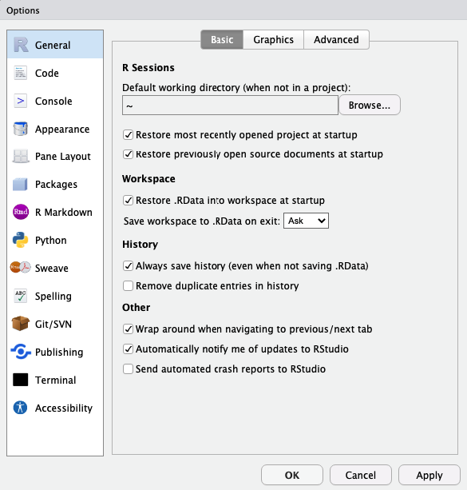
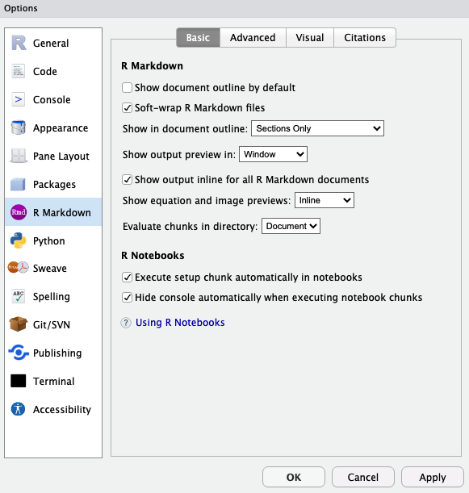
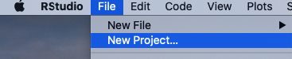

```{r setup, include=FALSE}

knitr::opts_chunk$set(echo = TRUE)
```

\

# *<span style="text-decoration:underline">How do I start?</span>*
\

## Instalation
\


* First, you need to download R through one of the mirrors [*here*](https://cran.r-project.org/mirrors.html) or directly use the Polish mirror [*here*](https://cran.mi2.ai)

\


\

* Now, we need to install IDE (integrated development environment) allowing us to send prompts to the computer, thus activating our code. That IDE in our case is _RStudio_, the most popular choice for handling R code. You can click [*here*](https://posit.co/download/rstudio-desktop/) to download RStudio for your operating system.
\
  + RStudio can also be run online via [RStudio Cloud](https://rstudio.cloud/), although it's a paid service
  + You can also use an online sandbox service, although keep in mind that it will make your data public, so you should avoid that if the data belongs to a company, is supposed to be patented or simply is private to you.
\
* IDE alternatives to RStudio: [Visual Studio Code](https://code.visualstudio.com), [RKWard](https://rkward.kde.org)

\
\

***

## Understanding RStudio
\

* RStudio looks like a bunch of programs fused into one - hence you'll have to get used to operating on its 4 different sections. For your convenience, a figure below explains what are those sections for.

\


\

***

## Setting up your workspace
\

* First, we need to adjust RStudio to our needs. To do so, find Global Options and check what options are adjustable. Keep in mind that everyone has different preferences, hence you need to find what works best for you!

\


\

* Now you can see General Options, which are the most crucial. 
\

  + Here you can decide on where all your edited files should be saved to, unless otherwise stated (like inside a Project - we'll go over them in minute!) - this is called a working directory, so a specified path you work in. <br> Further, you can decide whether the files you worked on last time you opened RStudio should reopen again for your convenience, or do you rather want to control it yourself!

  + Next General Option is quite important for those who tend to forget about saving their files! You can make RStudio save files for you by clicking 'Save workspace to .RData on exit:' on either 'Ask' or 'Always' (as Snape used to say)  

\




\

* Another interesting thing you can adjust is how is the code presented in the console, so in that left-down corner of RStudio. 
  + For your convenience, it's possible to keep the code highlighted with colors, same as in the Code Editor window (left-up corner of RStudio).
  + You can also decide on whether the error messages should be displayed in a different color (to allow you to spot them easily) or not.
  + Another thing to change is limiting the output length. This is useful while working with huge sets of data. Think about it - if you had a data set from clinical trials, you'd have data on thousands of patients. If you were to open that data set for analysis in R with a command, the output in the console would not only be unreadable, but also would take a lot of time. Hence, you can decide on limiting the output length to for example 1000. This way, if you load a data set as a table and open it in the console, it will only print the result up until the 1000th line/row in the table. This can save you time in the future!

\


\

* Appearance changes are not a necessity, *<span style="text-decoration:underline">but are something I very much recommend you to adjust!</span>* <br> I myself prefer dark modes, with colors allowing me to easily distinguish the most important elements of the code. <br> You can also decide on the font type as well as size! The latter can be useful when you're discussing your code in an online meeting and want your audience to focus on the code!

\


\

* Last, but not least, you can adjust __RMarkdown__ settings! 
  + RMarkdown (.Rmd) is a complex file type with text-based formatting, allowing the storage of the code in so called executable chunks and its comments, descriptions, outside, as a code that is not meant to be activated. 
  + RMarkdown files enable us to create dynamic documents with R. 
  + *<span style="text-decoration:underline">This page was first prepared as an RMarkdown file and later converted to HTML!</span>* 
  + R allows such conversion to .pdf or .docx as well, so R can allow you to create your student assignments in a great style!
  




***
\

## Creating your first project
\

* First thing you need to do is set up a new project now. Treat a project as your organisational unit for the Project you work on - keep every file related to that project there! For example, if you wanted to create an R program, you could create a project to store the executable .R file, together with the .Rmd file, providing more insights into the work.
* This seems like a boring necessity now - you might feel the urge of skipping this part. Find the power within you to oppose that feeling!

\


<div class = "row">
  
<div class = "col-md-6">

</div>
  
<div class = "col-md-6">
Being in a project helps you to be more organised! It'll help you avoid loosing your files. If you earlier set Global Options to save your workspace after closing, your project will be updated automatically!
</div>
</div>

\

<div class = "row">
  
<div class = "col-md-8">

</div>

<div class = "col-md-4">

This might be more important when you're more comfortable with R! 
\
Not only can you create a project out of already existing directory, but also start a GitHub-related project - this might be useful if you wanted to create a small website with R! 
\
You could link your project to a repository in GitHub and further render your RMarkdown file into HTML and publish it! 
\
*<span style="text-decoration:underline">Just as the site you see right now!</span>*
</div>
</div>

\
\
<div class = "row">
  
<div class = "col-md-8">


</div>
<div class = "col-md-4">
If you were to link your project to GitHub, next window you'd see would be asking you to put the link and the name of the repository related to this project. This allows you not only to have an online copy of your work, but also to create your GitHub Pages site.

</div>
</div>

\
\


## Setting up your working directory
\

Similarly to a project, **a working directory** is a must-have! It is the place where you'll store all your files during your work. Files will be created and saved in that specified path.

\
Do not use basic directories, like *'Documents'* or *'Downloads'*!! This creates a mess and makes finding your files difficult.

\
Beware of opening files from a different directory than the one you work with! If the names are similar, you might get confused and overwrite the wrong file!

\

Create a new directory/folder. You can do so in Files section with clicking the icon . Open it and set as  working directory. First find  icon, click on it and further choose .

\
\

## Creating your first file
\

> _Formats to choose from_

Click on the formats below to understand what will suit your work best.


<html>
<head>
<meta name="viewport" content="width=device-width, initial-scale=1">
<style>
.collapsible {
  background-color: #073973;
  color: #ffffff;
  cursor: pointer;
  padding: 18px;
  width: 100%;
  border: none;
  text-align: left;
  outline: none;
  font-size: 15px;
}

.active, .collapsible:hover {
  background-color: #073973;
}

.content {
  padding: 0 18px;
  max-height: 0;
  overflow: hidden;
  transition: max-height 0.2s ease-out;
  background-color: #2074d4;
}
</style>
</head>
<body>


<button class="collapsible">R Script [ .R ]</button>
<div class="content">
  <p>  
  \
  _Most suitable for scripting. It is the simplest format and its lines are all read when the file is activated._</p>
</div>
<button class="collapsible">R Markdown  [ .Rmd ]            ---*__Recommended option!__*</button>
<div class="content">
  <p>
  \
  _R Markdown allows you to put both the code and its explanation in 1 file. It introduces so called chunks, parts of the file specifically for the code. This means whatever you put inside, will be activated and processed. _
  \
  _Outside chunks you can write your comments in an elegant way, decide on the look of the titles, define whether you want the text **highlighted** *in a manner that* *<span style="text-decoration:underline">suits you best!</span>*. _
  \
  _When you gain more experience, you'll be able to create interactive reports in R, with graphs, tables and other data attached._
  \
  \
  _Additionally, R Markdown allows you to include scripts written in other languages than R - for example in JavaScript, Python or SQL! This means you can add interactive buttons (like the one you just clicked to see this definition!),  create a database or include a small program/game on your site. _
  \
  _R Markdown is a format allowing you to create basic websites, by translating your file to HTML. This allows you to get into Web Development without the need to understand the basics of HTML and CSS._
  </p>
</div>
<button class="collapsible">R Notebook [ also .Rmd ]</button>
<div class="content">
  <p>
  \
  _Every R Notebook is an R Markdown file - and the two are almost identical. However, R Notebook allows you to check how your file looks, without the need to save it to HTML/DOC/PDF._
  \
  _Whereas R Markdown has a **Knit** button allowing to save the file with a new extension (.html, .doc, .pdf), R Notebook additionally has a **Preview** option, allowing you to check the output before saving._</p>
</div>

<button class="collapsible">R Sweave [ .Rnw ]</button>
<div class="content">
  <p>
  \
  _Framework for LaTeX + R, for automatic report generation. Not only are the Sweave reports dynamic, but also can update themselves automatically. _
  \
  _More on that file type [**here**](https://rpubs.com/YaRrr/SweaveIntro), [**here**](https://ds.dfci.harvard.edu/~aedin/courses/ReproducibleResearch/Workshop-reproducible-research_pgf.pdf) and [**there**](https://journal.r-project.org/news/RN-2002-3-sweave-part-i-mixing-r-and-l/RN-2002-3-sweave-part-i-mixing-r-and-l.pdf). _
</p>
</div>

<button class="collapsible">R Shiny </button>
<div class="content">
  <p>
  \
  _Powerful package (more on them soon!) for web app development without requiring HTML, CSS or JavaScript knowledge. If you want to create interactive graphs with multiple filter arguments this is the best way to do that!_
  \
  _Best tutorial on Shiny is available [**here**](https://shiny.posit.co/r/getstarted/shiny-basics/lesson1/index.html)._
</p>
</div>
<script>
var coll = document.getElementsByClassName("collapsible");
var i;

for (i = 0; i < coll.length; i++) {
  coll[i].addEventListener("click", function() {
    this.classList.toggle("active");
    var content = this.nextElementSibling;
    if (content.style.maxHeight){
      content.style.maxHeight = null;
    } else {
      content.style.maxHeight = content.scrollHeight + "px";
    } 
  });
}
</script>

</body>
</html>

\
During our classes I advise you to use _R Markdown files_, as they are enabling us to be precise which part of the file is text and which is code. 
\
Also, this type of files allows you further translation of the file to HTML, DOC or PDF, which means you can easily learn how to make nice-looking reports on anything you like! Whether it's job, university or hobby -related!


***


# *<span style="text-decoration:underline">Begin working with R</span>*
\

## Activate the code 
\

The easiest, fastest and most recommended method to do that is using **a key shortcut**:

<html>
<head>
<style>
.button {
  background-color: #073973;
  border: none;
  color: white;
  padding: 15px 32px;
  text-decoration: none;
  display: block;
  font-size: 16px;
  margin: 4px 2px;
  cursor: pointer;
}
</style>
</head>
<body>


<button class="button">Ctrl</button> \+ <button class="button">Enter</button>

</body>
</html>


\

The combination of these two will result in the activation of either a line in which we currently write or of a specific selection we choose (highlight).

\
\
Additional options:
\

* You can use the **Console** (left-down part of RStudio) to write prompts directly or to paste code written beforehand in a file.
+ If you're using .Rmd (R Markdown/Notebook) files with executable code **chunks**, you can find the **green triangle icon** to click on in the **right-up corner of the chunk**  , if you want **all the code in the chunk to be activated**. This will however **<span style="text-decoration:underline">print the result of the code right at the end of the activated chunk! </span>** To change that, click on  right next to  in the Code Editor section and choose . If you however want to see the output right under the activated chunk, click .
+ Select the line of code in the Code Editor, being in your file. Find  **button** and click on it. You'll see the effect in the Console.

\

Let's try and activate our first line of code! The easiest thing we can ask the computer to calculate for us is a sum of two numbers. 
Below, in the first line you can see what you need to write (5 + 13) and in the next line, with '## [1]' prefix you see the result of that calculation.


```{r, eval=TRUE}
5 + 13
```

\

***

## Exercise 1

\
Given that you already made a project, defined a working directory and created your first .Rmd file, you're ready to start your notes!
\

Now copy the code from the white space below to your first chunk in the .Rmd file and activate it to see how to perform basic arithmetic tasks in R.
To add a new chunk use a shortcut Alt+Ctrl+I.
\

Remember R respects the order of math equations, hence sometimes parenthesis might be necessary. Define whether the last 2 equations have the same output and write the answer outside the chunk, as a text.


```{r artithmetic, eval=FALSE}

5 + 13

24 - 8

24^2

24*2

35/5

6+3/3

(6+3)/3

```

\

***

Let's take a look at the last equation again.
```{r, eval=FALSE}
(6+3)/3
```

Let's suppose you have 9 candies in your backpack and you're taking a walk with your 2 friends. You've decided you do not feel like eating sugar and gave one friend 6 candies, and 3 to the other.
\
Now with this setting, our equation allows us to count the mean amount of candies you and your 2 friends had.
\
However, with the amount of candies to give, comes the amount of numbers we'd need to add to our equation. Instead, to make it easier for each time we would need to count the mean, we could define a set of rules and clarifications allowing the computer to understand what a mean actually is. This way, the next time we'd need the mean, we'd only have to provide a list of numbers of candies, and computer will evaluate how many numbers we provided and what is its sum, by itself.

This is exemplified by the code below, where we define that one person got 6 candies, 2nd person 3 and the third (ourselves) - 0 :

```{r, eval=TRUE}
mean(c(6,3,0))
```

As you can see the output is the same. We'll now focus a bit more on functions and just how much they improve our coding experience.

\

***

\


## Functions
\

While summing two numbers together was an easy task to understand for a computer, other jobs might need more explanation. 
\

Functions are containing such sets of rules and clarifications, dividing bigger jobs into smaller parts.
\
\

Click on the button below to view a list of useful arithmetic functions.

\

<html>
<head>
<meta name="viewport" content="width=device-width, initial-scale=1">
<style>
.collapsible2 {
  background-color: #073973;
  color: #ffffff;
  cursor: pointer;
  padding: 18px;
  width: 100%;
  border: none;
  text-align: left;
  outline: none;
  font-size: 15px;
}

.active, .collapsible2:hover {
  background-color: #073973;
}

.content {
  padding: 0 18px;
  max-height: 0;
  overflow: hidden;
  transition: max-height 0.2s ease-out;
  background-color: #2074d4;
}
</style>
</head>
<body>


<button class="collapsible2">Arithmetic functions </button>
<div class="content">

```{r s, eval=FALSE}
min(x)        # minimal value from a given set 'x'
max(x)        # maximum value from a given set 'x'
mean(x)       # the mean value from a given set 'x'
sum(x)        # sum of all (numerical) values from a given set 'x'
sd(x)         # standard deviation from a given set 'x'
var(x)        # variance from a given set 'x' [how different are our data in a given set]
median(x)     # median from a given set 'x'
range(x)      # range of set 'x' 
abs(x)        # absolute value of x ['-1.5' will be printed as "1.5"]
log(x)        # natural logarithm of 'x', where base is 'e'
log(x, base)  # logarithm of 'x' with the base different than 'e'
log10(x)      # logarithm of 'x' with the base 10
sqrt(x)       # square root of 'x'
round()       # rounding numbers
signif()      # rounding numbers
```
</div>
<button class="collapsible2">Trigonometric functions </button>
<div class="content">
```{r trigonometric functions, eval=FALSE}
cos(x)  # cosinus of x
sin(x)  # sinus of x
tan(x)  # tangens of x
acos(x) # arcus cosinus of x
asin(x) # arcus sinus of x
atan(x) # arcus tangens of x
```
</div>
<button class="collapsible2">Statistical functions </button>
<div class="content">
```{r statistical functions, eval=FALSE}

lm()      # Determine the least-squares regression line
anova()   # Analysis of variance (can use on results of lm())
predict() # Obtain predicted values from linear model
nls()     # Estimate parameters of a nonlinear model
cor(x,y) # Correlation coefficient between contents of x and of y
```
</div>

<button class="collapsible2">Basic functions </button>
<div class="content">
```{r basic functions, eval=FALSE}

setwd()            # set a working directory
getwd()            # "find and show me my working directory"
install.packages() # for installing packages with defined functions
library()          # load the package in order to use it
sessionInfo()      # check what is your R version, what packages are loaded and what are your pc and operatic system specifics
download.file()    # allows you to automatically download files from the internet, providing arguments: url="" and destfile = ""
```
</div>
<script>
var coll = document.getElementsByClassName("collapsible2");
var i;

for (i = 0; i < coll.length; i++) {
  coll[i].addEventListener("click", function() {
    this.classList.toggle("active");
    var content = this.nextElementSibling;
    if (content.style.maxHeight){
      content.style.maxHeight = null;
    } else {
      content.style.maxHeight = content.scrollHeight + "px";
    } 
  });
}
</script>

</body>
</html>

\
Let's explore that last section, basic functions.
\

A moment ago, you set a new folder as a working directory, but you could have asked the computer to do that for you! You'd have to divide that into understandable tasks:
\

1. Click on 'More'
2. Click on 'Set As Working Directory'
\

The function to do that was already written by somebody, and is called **setwd()**. 
\
\

Try it out yourself! 
\
First, copy the following snippet to RStudio:

```{r2, eval=FALSE}
setwd("C:/Write-Path-Here")
```

... and paste the path to your new folder inside parenthesis ("").

\

> Make sure the function did its job!
\

In Files Tab again, find  icon, click on it and further choose .
\

OR you can use a dedicated function instead:
\

```{r getwd, eval=FALSE}
getwd()
```

You might've noticed that each of the functions we discussed had parenthesis () present. Keep that in mind.
\
\

If you find a phrase or function you don't understand, it's best to put a question mark on the left, select the whole phrase with it and activate the code. The explanation will appear in the 'Help' section of RStudio (right-down window).

```{r help, eval=FALSE}

?help
?download.file()
```


If you don't know the specific name of a given function you want to use but know what it's supposed to be doing, you can use **help.search("")**
```{r}
help.search("download")
help.search("graphs")
```

\
\

Now, look again into *arithmetic functions*.
\

At the end of the section, you're provided with 2 functions allowing you to round up your values to a given digit or decimal point.
\

Let's learn the difference between them!

```{r roundnum, eval=FALSE}

x <- 23.45

round(x)              #23    # to next natural number 
round(x, digits = 0)  #23    # to single digits
round(x, digits = 1)  #23.4  # to first decimal point 
round(x, digits = 2)  #23.45 # to 2nd decimal point

signif(x, 1) #20     # to double digits
signif(x, 2) #23     # to single digits
signif(x, 3) #23.4   # to first decimal point
signif(x, 4) #23.45  # to 2nd decimal point

```

\
\

Presented functions are all installed automatically with R, but as you might imagine, they cannot meet the expectations of each and every user.
\
That's why people started writing their own functions - and luckily many of them release it later for free!
\
Such a set of user-defined functions available for download is called a **package**.
\
We'll briefly discuss them in a moment, but only after you finish the next exercise.


***

\

## Exercise 2
\

Recreate the last code snippet for the variable _y_. Write the answers in the same way, as comments. (This means: use round() and signif() in the same way)

y = 23.56


\
\

***
\

## Packages

To check what kind of **packages** you have installed and loaded onto your current R session, you can use:
```{r packages1, eval=FALSE}
sessionInfo()
```
This will also print details on your operating system.

If the package you want to use is not on the list, its functions will not work. Hence, if we wanted to load a package called **tidyverse**, we can execute:
```{r library, eval=FALSE}
library("tidyverse")
```

If you don't have tidyverse installed, you can do it with:
```{r install, eval=FALSE}
install.packages("tidyverse")
```


<html>
<head>
<meta name="viewport" content="width=device-width, initial-scale=1">
<style>
.collapsiblee {
  background-color: #073973;
  color: #ffffff;
  cursor: pointer;
  padding: 18px;
  width: 100%;
  border: none;
  text-align: left;
  outline: none;
  font-size: 15px;
}

.active, .collapsiblee:hover {
  background-color: #073973;
}

.content {
  padding: 0 18px;
  max-height: 0;
  overflow: hidden;
  transition: max-height 0.2s ease-out;
  background-color: #2074d4;
}
</style>
</head>
<body>


<button class="collapsiblee">Useful packages</button>
<div class="content">
<p>
\
```{r packages_useful, echo=FALSE, eval=TRUE}

library(rmarkdown)


usf_packages <- data.frame(
  Package = c("tidyverse", "ggplot2", "tidyr", "plotly",
"shiny", "caret", "mlr3", "knitr", "stringr", "xaringan", "data.table", "devtools"),
  Description = c(" general data science stuff", "visualization, graphs", "organizing data", "interactive web graphs", "interactive graphs/web dev", "regression, machine learning", "machine learning", "generating reports", "string manipulation", ".Rmd to html preview knitted on save", "convert data frames to tables", "make your own package")
)

paged_table(usf_packages)


```
</p>

</div>


<script>
var coll = document.getElementsByClassName("collapsiblee");
var i;

for (i = 0; i < coll.length; i++) {
  coll[i].addEventListener("click", function() {
    this.classList.toggle("active");
    var content = this.nextElementSibling;
    if (content.style.maxHeight){
      content.style.maxHeight = null;
    } else {
      content.style.maxHeight = content.scrollHeight + "px";
    } 
  });
}
</script>

</body>
</html>


If you want to browse the Packages you have and might have, you can do so in the Tab 'Packages' (right-down window in RStudio).

We'll use several packages in the next classes to come. 
\
Now, let's understand data types in R.


\

***

\

## Data types
\

You already saw that R can take up numeric values, but it's not the only data type there is!
\

Basically, we can divide data types in R into **primitive** (containing single objects) and **complex** (containing sets of objects). 
\

Click on the buttons below to find out more on data types in R. Copy the code snippets and execute it in the console to see the output.

\
\

<html>
<head>
<meta name="viewport" content="width=device-width, initial-scale=1">
<style>
.collapsible3 {
  background-color: #073973;
  color: #ffffff;
  cursor: pointer;
  padding: 18px;
  width: 100%;
  border: none;
  text-align: left;
  outline: none;
  font-size: 15px;
}

.active, .collapsible3:hover {
  background-color: #073973;
}

.content {
  padding: 0 18px;
  max-height: 0;
  overflow: hidden;
  transition: max-height 0.2s ease-out;
  background-color: #2074d4;
}
</style>
</head>
<body>

<p> 

> *Object classes:* 

</p>
<button class="collapsible3">Numeric</button>
<div class="content">
  <p>  
  _All real numbers - either whole or with a decimal point._
  \
  
  _Numeric values can be either integer or single/double precision. _
  \
  
  _**Integers** are whole numbers, without decimal points. You can specifically state a given number to be an integer by adding the letter 'L' after it._
  \
  
  _Single precision usually only occurs when calling C or FORTRAN._
  \
  
  _Most numbers will take a form of **double** precision. Even if we know a number is an integer, it can still be overwritten as a double._

```{r numeric, eval=FALSE}

number1 <- 20        
class(number1)    # numeric

number2 <- 20L     
class(number2)    # integer

number3 <- 20.1     
class(number3)    # numeric

```

</div>
<button class="collapsible3">Logical</button>
<div class="content">
  <p>
  _Also called Boolean values: TRUE and FALSE, which can also sometimes be represented with a binary system 1 and 0, respectively._
  \
  _They allow us to check whether a given condition is met by our data, for example we could estimate whether Anna_age is less than 20 - which will turn out to be false in our case._

```{r logical, eval=FALSE}

assumption <- 20 > 10      # our statement is numerical, but it's a condition
class(assumption)          # That condition is TRUE so the value of assumption is TRUE 


assumption2 <- 20 < 10      # our statement is numerical, but it's a condition
class(assumption2)          # That condition is FALSE so the value of assumption2 is FALSE

```

</p>
</div>

<button class="collapsible3">Complex</button>
<div class="content">
  <p>
  _Sometimes math requires using imaginary components, like the letter 'x' which is unknown._
  \
  
  _Examples: 1+2i, 3i, 90-8i_
  \
  
  _Keep in mind that the imaginary component should not be the letter 'L'._

```{r complex, eval=FALSE}

its_complicated <- 1+2i      
class(its_complicated)          # complex

its_complicated2 <- 1+2L      
class(its_complicated2)         # numeric

its_complicated3 <- 1L+2L      
class(its_complicated3)         # integer

```


</p>
</div>

<button class="collapsible3">Character</button>
<div class="content">
  <p>
  _Stores data composed of letters or of a string (object combined of letters and numbers) read as a text. This means that if you define "3L" as a string, rather than an integer, it will not be understood as a number available for mathematical analysis, but rather a string, which is not available for calculations._
  \
  
  _An example of a character class would be "Anna" because its composed of characters read as a text. You might've noticed that Anna is written in quotation marks. This is the easiest way to define a given word as a text, rather than an object. If we omit the quotation marks, Anna will be understood as the name of the variable, rather than a text value._


```{r character, eval=FALSE}

character1 <- "Maria"      # Text
class(character1)          # character


character2 <- "Mario1990"  # String (Text + Number)
class(character2)          # also character

```

</p>
</div>


<button class="collapsible3">Date</button>
<div class="content">
  <p>

_Enables us to store dates. We can define whether the year should appear as the first argument or the last._

_Copy the code below to see the example._

```{r date, eval=FALSE}

date <- "01-07-2024" # String
class(date)          # character

date2 <- as.Date(date, "%d-%m-%Y") 
date2
class(date2)         # date

date3 <- "2024-07-01"
date4 <-as.Date(date3, "%Y-%m-%d")
date4
class(date4)         # date

```
  </p>
</div>

<button class="collapsible3">Raw</button>
<div class="content">
  <p>
  _Holds and translate other classes into raw bytes._
  \

```{r raw, eval=FALSE}

text <- "Hello World"
class(text)

text <- charToRaw(text)
class(text)
text
```

</p>
</div>

\
\

<p> 
> *Data structures (containing many objects):* 

</p>

<button class="collapsible3">Vector</button>
<div class="content">
  <p>
  _Simply a selection of items/elements of the same kind inside 1 variable. This means vectors contain only one class of objects (whether it's numeric, logical, complex, character, raw or date). You can also think about it as a particular column in your data set, particular descriptor, which has the same type of values._
  \
  
  _In order to nest multiple elements into 1 variable, we need to define that objects separated by a comma should be considered as one group of data._
  \
  
  _To do that, we use 'c()'._
  \
  
  _Vectors will be visible in the Environment Tab in the section Values._

```{r vector, eval=FALSE}

# This prints Error: unexpected ',' in "first_vector <- "Hello","
first_vector <- "Hello", "World"     

# This is correct, you should now see this variable defined in the Environment 
second_vector <- c("Hello", "World") 

```

</p>
</div>

<button class="collapsible3">List</button>
<div class="content">
  <p>
  _Lists are vectors with multiple classes of objects inside. This means lists can store both the values of TRUE as well as 2 or "Maria" or any other class of objects._
  \
  
  _Lists will be visible in the Environment Tab in the section Data. You can see a blue button right next to it, with a small white triangle inside. If you click on it, you'll see both the arguments inside, as well as their class._
  \

  _You can copy the following code and activate it to see how it looks like._

```{r list, eval=FALSE}

first_list <- list("Hello", "World", "2023", 2024)     

```

</p>
</div>

<button class="collapsible3">Matrix</button>
<div class="content">
  <p>
  _Matrices are two-dimensional data sets with specific number of columns and rows generated (meaning we can define the arguments of the function matrix(), nrow and ncol (number of rows and columns, respectively)). They can take up different classes of objects._
  \

  _Matrices use 'c()' to nest multiple objects inside 1 matrix, same as vectors._

```{r matrix, eval=FALSE}

new_matrix <- matrix(c("Hello", "World", FALSE, 2024))

new_matrix2 <- matrix(c("Hello", "World", "2023", 2024), nrow = 2)

new_matrix3 <- matrix(c("Hello", "World", "2023", 2024), ncol = 2)

```

</p>
</div>

<button class="collapsible3">Data Frame</button>
<div class="content">
  <p>
  _Used for building small tables, data sets etc. Notice the blue dot with white triangle on it, right next to the data frame variable name, while creating a data frame._
  \

  _During data analysis exercises, we'll focus on making data frames out from .csv files. However, using bigger sets of data you might notice the console takes much time to get through the whole file._
```{r dataframe, eval=FALSE}


dataframe1 <- data.frame(words=c("Hello", "World"),
                         logical = c(TRUE, FALSE),
                         numbers= c(2023, 2024)
                         )

dataframe1

```


</p>
</div>


<button class="collapsible3">Table</button>
<div class="content">
  <p>
  _Enhanced version (extension) of the data frame, with the same practicality but different syntax (so every table is a data frame, but not the other way around). In fact, tables are a package enhancing the speed of indexing, creating inner joins, making sorting and grouping data more simple. However, the creation of the table must be derived from an already existing data frame._
  \

  _It runs 20 times faster than data frame, is more code efficient (we need to write less code to obtain the same result), so it's a preffered option whenever we study a big set of data. However, tables can be confusing for beginners._

```{r table, eval=FALSE}

#install.packages("data.table")        
# activate if you don't have the package yet!!

library(data.table)

dataframe1 <- data.frame(words=c("Hello", "World"),
                         logical = c(TRUE, FALSE),
                         numbers= c(2023, 2024)
                         )

datatable1 <- data.table(dataframe1)

```

</p>
</div>

<button class="collapsible3">Factor</button>
<div class="content">
  <p>
  _Factors are used to group, categorize your data. If your column in the data set comprises of several repeated values, this can be read as a category by which we can define the column._
  \

  _For example if we analyze the height of teens in the age of 18, we can categorize data based on the gender of the teen, to specify how the mean height of girls differed from the height of boys. This means that if our data set comprises of the column 'Gender' with arguments of 'Male', 'Female', 'Other', we can try to define connections between the results obtained for each group._
  \
  
  _Another example might be when we'd check mortality from cancer in the USA based on the state - we could then specify whether cancers occur more dominantly in specific regions (or whether the data is good enough to consider in the analysis)._
  \
  
  _Although factors are considered data structures, they work best in relation to a specific column in a data frame / table._

```{r factor, eval=FALSE}

# Let's create a data frame with the word 'Hello' occuring twice.
dataframe3 <- data.frame(words=c("Hello", "World", "Hello"),
                         logical = c(TRUE, FALSE, FALSE),
                         numbers= c(2023, 2024, 2025)
                         )
# Some computers define given columns as factors automatically. 
# You can check whether a given column is a factor by clicking that white triangle in the Environment Tab.
# If however it's not done automatically, you can specify a given column to be a factor with a function 'as.factor()'

dataframe3$words <- as.factor(dataframe3$words)

str(dataframe3$words)  # print how many categories are inside the factor (here meaning "how many different words does the column have)

# You can see that the syntax to specify a column in a given data frame considers a dollar sign $ between the name of the data frame and the name of the column
```


</p>
</div>


<script>
var coll = document.getElementsByClassName("collapsible3");
var i;

for (i = 0; i < coll.length; i++) {
  coll[i].addEventListener("click", function() {
    this.classList.toggle("active");
    var content = this.nextElementSibling;
    if (content.style.maxHeight){
      content.style.maxHeight = null;
    } else {
      content.style.maxHeight = content.scrollHeight + "px";
    } 
  });
}
</script>

</body>
</html>

\
\


***

\

## Changing object classes
\
\

``` {r changing_classes, eval=FALSE}

start <- 3L

class(start)        # integer

start <- as.numeric(start)
class(start)        # numeric

start <- as.double(start)
class(start)         # double

start <- as.character(start)
class(start)         # character

date3 <- "2024-07-01"
date4 <-as.Date(date3, "%Y-%m-%d")
date4
class(date4)         # date

text <- "Hello World"
text <- charToRaw(text)  
class(text)          # raw


dataframe1 <- data.frame(words=c("Hello", "World"),
                         logical = c(TRUE, FALSE),
                         numbers= c(2023, 2024)
                         )

# Modifying the class of data frame/table columns:

dataframe1$words <- as.factor(dataframe1$words)
dataframe1$words <- as.integer(dataframe1$words)
dataframe1$words <- as.logical(dataframe1$words)

```


\
\

***

\
\

## Variables

\

You can ask the computer to remember given values (like numeric values) as a given phrase (also called an object).
\
\

For example, I can say I need the computer to remember the age of my sister, who is 23 years old. Hence I can state that every time I activate the word 'Anna_age', I want the output to show her age - 23. To do that, copy the code lines below to your working file and look on what is the output.
\
\

<div class = "row">
  
<div class = "col-md-4">

```{r anna, eval=FALSE}
Anna_age <- 23
Anna_age
```

</div>

<div class = "col-md-8">

**Anna_age** is the name of the variable now stored/remembered by our current R session.
What you wrote on the left became the name of what was on the right. So **Anna_age** is the name indicating a number 23, just like in high school x indicated a specific number.


</div>
</div>

\

Between **Anna_age** and 23 you can see an arrow pointing from right to left. This is an **assignment operator**, used to assign values, for example to given variables.


\

<div class = "row">
  
<div class = "col-md-4">

</div>

<div class = "col-md-8">


This means you can now see the new variable in the up-right window of RStudio, .
\


</div>
</div>

\
\

***

\

## Assigning operators

\
\

<p style="text-align: center;"><span style="text-decoration:underline">**_There are more assigning operators in R, but we'll stick to the arrow ( <- )._**</span></p>
\
\

> **<span style="text-decoration:underline">Why not ( = ) ?</span>**

\

You might feel the urge to use equal sign ( = ) instead, given you probably got used to it with Python.
\

However, although accepted in some cases, '=' does not have the same meaning as '<-' in R. 
\

Equal sign '=' can be understood not only as an assigning operator, but also as a **syntax token** that signals named argument passing in a function call. 
\

For example if the function considers a color for our text, you can write 'color = blue', but it will not define the variable color to be equal to 'blue', but rather understand that we want the text in the color blue. In other words, we won't create a variable named *color* with character class data of *"blue"*, but define that a color of our text should be blue.
\
\

***

\


## Exercise 3
\

To give you another example - copy and execute line below:

```{r ex2.1, eval=FALSE}
matrix(1:6, nrow = 2)
```

Now you should see a matrix printed onto the console, with numbers from 1 to 6, situated in 2 rows, given that we defined nrow (number of rows) to be equal to 2.
\
\

Check the Environment Tab - do you see 'nrow' as a newly added value, like 'Anna_age'? Write the answer in your file, with a hash tag # present (to understand it as a comment).
\
\

Now, let's try with an arrow as an assigning operator:
```{r ex2.2, eval=FALSE}

matrix(1:6, nrow <-2)

```

Check the Environment Tab again.
\

You should now see 'nrow' understood as a **variable**, equal to 2.
\

In a nutshell, both codes will print you a matrix with 2 rows, but only '<-' will assign the value to the Environment. 
\

You can make sure by using '=' again to try and change the value of variable 'nrow' now. 
\
\

Copy the next line:
\

```{r ex2.3, eval=FALSE}

matrix(1:6, nrow = 3)

```

Did the value of 'nrow' change? Write an answer in your file, with a short explanation. 
\
\


\

***

\

## Operators

\

Besides assigning operators, we also have relational, logical and miscellaneous operators. 
\
Check details on all of them by clicking on the bars below. Here, you can learn on assigning operators other than <- and = .


\

<html>
<head>
<meta name="viewport" content="width=device-width, initial-scale=1">
<style>
.collapsible4 {
  background-color: #073973;
  color: #ffffff;
  cursor: pointer;
  padding: 18px;
  width: 100%;
  border: none;
  text-align: left;
  outline: none;
  font-size: 15px;
}

.active, .collapsible4:hover {
  background-color: #073973;
}

.content {
  padding: 0 18px;
  max-height: 0;
  overflow: hidden;
  transition: max-height 0.2s ease-out;
  background-color: #2074d4;
}
</style>
</head>
<body>


<button class="collapsible4">Relational operators</button>
<div class="content">
  <p>  
  
<html>
<head>
<style>
.button2 {
  background-color: #073973;
  border: none;
  color: white;
  padding: 15px 32px;
  text-decoration: none;
  display: inline-block;
  font-size: 16px;
  margin: 4px 2px;
  cursor: pointer;
  border-radius: 50%;
}
</style>
</head>
<body>


<button class="button2"> \> </button> 
<button class="button2"> \< </button>
<button class="button2"> \>\= </button>
<button class="button2"> \<\= </button>
<button class="button2"> \=\= </button>
<button class="button2"> \!\= </button>

</body>
</html>


</div>
<button class="collapsible4">Logical operators</button>
<div class="content">
  <p>
    
<html>
<head>
<style>
.button3 {
  background-color: #073973;
  border: none;
  color: white;
  padding: 15px 32px;
  text-decoration: none;
  display: inline-block;
  font-size: 16px;
  margin: 4px 2px;
  cursor: pointer;
  border-radius: 50%;
}
</style>
</head>
<body>


<button class="button3"> \& </button> 
<button class="button3"> \| </button> 
<button class="button3"> \&\& </button> 
<button class="button3"> \|\| </button> 
<button class="button3"> \! </button> 
<button class="button3"> \!\= </button> 


</body>
</html>

  </p>
</div>
<button class="collapsible4">Assignment operators</button>
<div class="content">
  <p>
    
<html>
<head>
<style>
.button4 {
  background-color: #073973;
  border: none;
  color: white;
  padding: 15px 32px;
  text-decoration: none;
  display: inline-block;
  font-size: 16px;
  margin: 4px 2px;
  cursor: pointer;
  border-radius: 50%;
}
</style>
</head>
<body>


<button class="button4"> \<\- </button> 
<button class="button4"> \<\<\- </button> 
<button class="button4"> \=\= </button> 
<button class="button4"> \-\> </button> 
<button class="button4"> \-\>\> </button> 


</body>
</html>

</p>
</div>

<button class="collapsible4">Miscellaneous operators</button>
<div class="content">
  <p>
     
<html>
<head>
<style>
.button5 {
  background-color: #073973;
  border: none;
  color: white;
  padding: 15px 32px;
  text-decoration: none;
  display: inline-block;
  font-size: 16px;
  margin: 4px 2px;
  cursor: pointer;
  border-radius: 50%;
}
</style>
</head>
<body>

<button class="button5"> \: </button> 
<button class="button5"> <p>%in%</p> </button>
<button class="button5"> \%\*\% </button> 

</body>
</html>

</p>
</div>


<script>
var coll = document.getElementsByClassName("collapsible4");
var i;

for (i = 0; i < coll.length; i++) {
  coll[i].addEventListener("click", function() {
    this.classList.toggle("active");
    var content = this.nextElementSibling;
    if (content.style.maxHeight){
      content.style.maxHeight = null;
    } else {
      content.style.maxHeight = content.scrollHeight + "px";
    } 
  });
}
</script>

</body>
</html>

\

 *<span style="text-decoration:underline">Notice that '!=' (meaning a value should NOT be equal to the next value on the right) is both a relational and a logical operator!</span>* 


***
\

## Name your variable
\

* Avoid using spaces, dots, commas, colons and semicolons (as they have their own meaning and might make the computer misunderstand your task).
+ Don't **start** with a number!! ('2xAnna' --- WRONG but 'x2Anna' --- CORRECT)
+ Keep in mind R is case sensitive (differentiates between upper and lower case letters) so a variable 'anna' is a different variable than 'Anna'.
+ Do not use names reserved for functions! For example, you learned the function mean(), so it's better not to name the variable storing the mean simply as the word 'mean'. It's better to use for example 'mean_grades', so not only the variable is self-explanatory, but also does not confuse our computer.
+ Remember that the name should be clear to you! It's not a good practice to name your variables "x/y/z", because it's easy to forget what it meant!

\
\

***

\
\


## Unfinished variables
\

While coding, it's sometimes easy to forget about small details - for example to close parenthesis ')' or a citation (" or ').
R will detect this and ask us if we're sure our code is truly correct.
\
\

Find out yourself! Copy the line below to your file and activate it:


<div class = "row">
  
<div class = "col-md-4">

```{r unfinished, eval=FALSE}
  
my_age <- 

```

</div>

<div class = "col-md-8">

After activating the code an addition sign ( + ) is printed in the Console, asking us to finish the code.
\
Write your age as the content of the new variable 'my_age' and click Enter. 
</div>
</div>

Did the value appear in the Environment Tab?
\
\

There are however situations when the code is incomplete not at the end of the line but in the middle.
\

We're then forced to ask the console to terminate the task. To do that, once you see the '+' in the console, just press Esc and console should now have its basic > sign at the beginning of the line.
\
\

***

\
\

## Print your variable
\

Sometimes, you'll want to make sure your variable was indeed saved, but refuse to go through your Environment Tab (which can happen sometimes... for example when you have more than 30 variables within one project!). 
\

Within a program it's also sometimes useful to check on the value of particular variables - for example to see how many times did the program (or its specific part) run!
\

To do that, you can use the function 'print' or simply put your expression in parenthesis to state the change and print it to the console in the same time!
\


Both of the lines below will lead to the same output in the console. Try it out yourself!

```{r variable_print, eval=FALSE}

(new_variable <- 3) # Here you both assign the value and print it with 1 line of code

print(new_variable) # Here you only print an object which is already stated

```
\
\


***

\

## Variable Calculations
\

Variables are available for mathematical calculations in the same manner as you did with numbers earlier. You can also use the operators you learned in order to find out whether given phrases turn out to be true.

It comes in very handy when our variable saves not only 1 parameter but rather plenty (so when it contains many objects), given that it will enable us to perform calculations on columns of our data. This means, you won't have to calculate a given descriptor one by one, row by row, but rather all column at once.
\

Examples of calculations on variables:
\

``` {r var_calc, eval= FALSE}

new_variable*2

new_variable/2

my_age/new_variable

sum(my_age, new_variable)


# Checking if the value of my age meets the condition of both higher or equal to 18 AND lower or equal to 30 [TRUE only if both conditions are met]

(my_age >= 18 & my_age <= 30) 

# Checking if the value of my age meets the condition of both higher or equal to 18 OR lower or equal to 30. [TRUE if either one of the conditions are met]

(my_age >= 18 | my_age <= 30) 

```

\

***

\

## Overwrite your variable 

\

You need to understand that if you overwrite a given variable, only the new value will be remembered.
\

Copy the following code to your file and execute the code. 

```{r, eval=FALSE}

new_variable <- 5
(var_index <- new_variable / 2)
new_variable <- 10
(var_index <- new_variable / 2)

```
\

Why did the output change?
\
\


***

\
\


## Exercise 4
\

What is the output of the following snippet?
\

Copy the whole code to your file and activate it.
\

Look at the output and copy it to '# comment' section, leaving the # present! Define why class of statement and "statement" is different.

```{r exercise2, eval=FALSE}
no <- 3L
class(no) # write your comment like this! You can state here what is the class of object 'no'

yes <- 3
class(yes) # comment

statement <- Anna_age < 20
class(statement)                 # comment
statement                        # comment

class("statement")               # comment

name <- "Anna"
class(name)                      # comment

Anna_age/3                       # write output here
Anna_age <- 27
Anna_age/3                       # write and explain output here


# Below write a statement which would use the relational and logical operators in order to ask the console whether Anna_age variable is now higher than or equal to (!) 26 AND IN THE SAME TIME lower than or equal to 30.

# Write your statement here (remember to delete hash tag, so that it's seen as a code)

```

\

***

\

# *<span style="text-decoration:underline">Manage data structures</span>* 

\

It's time to focus on data structures containing many objects! Feel free to go back to *'Data Types'* to read the basis of each data type once more.
\

Here, we'll focus on the possibilities each of the data type gives us and functions we can use with them. Copy the code to your file and see what's the output of each line.
\
\


***

\
\

## Vectors/lists

We can apply the same methodology to edit both vectors and lists.
\

```{r vector_list, eval=FALSE}

new_vector <- c("Hello", "World", "I", "am", "ET") 
sorted_vector <- sort(new_vector)

# R counts from 1, NOT FROM ZERO! 
new_vector[1]          # access the first argument in the vector
new_vector[c(1,3)]     # choose a selection of 1st and 3rd argument printed
new_vector[c(-1)]      # access everything EXCEPT the first argument

# Create a new vector by repeating each of the 1st and 3rd value once

repeat_new_vector <- rep(new_vector[c(1,3)], each=1)

# Create a new vector by repeating each of the 1st and 3rd value twice

repeat_new_vector2 <- rep(new_vector[c(1,3)], each=2)

# If we want to copy the values two times:

repeat_new_vector3 <- rep(new_vector[c(1,3)], times=2)

# Check the difference between 'each' and 'times'
# by taking a look into the created vectors and their order.

# Sequence vector (both lines give same output):

range_of_numbers <- 1:10
range_of_numbers2 <- c(1,2,3,4,5,6,7,8,9,10)


# Add new values to your vector:

## at the end of the vector
range_of_numbers  <- c(range_of_numbers, 11) 
range_of_numbers <- append(range_of_numbers, 12) 
range_of_numbers <- append(range_of_numbers, 13, after = last(range_of_numbers)) 

## at the beginning of the vector
range_of_numbers  <- c(0, range_of_numbers)   
range_of_numbers <- append(range_of_numbers, -1, after = 0) 

# We can check the length of the vector (how many objects are inside)

length(range_of_numbers)

# Let's check whether the number 11 is inside the vector range_of_numbers

11 %in% range_of_numbers      # the answer should be logical
```


\
\


***

\
\

## Matrices/tables/data frames
\

Again, we'll focus our examples on matrices, but in the same time you can use the same commands and functions for tables and data frames.
\

Additionally, during data analysis exercises, we'll explore the data frames related functions more.

```{r matrices, eval=FALSE}

first_matrix <- matrix(1:6, nrow=3, ncol=2)

new_vector_now <- c("Hello", "World", "I", "am", "ET", 1, 2, 4, 8, 6) 

second_matrix <- matrix(new_vector_now)

third_matrix <- matrix(new_vector_now, first_matrix, nrow =2, ncol = 5)

third_matrix[1, 3]
third_matrix[1, ]
third_matrix[, 1]
third_matrix[c(1,2), 1]

# Add a new column containing numbers 7, 8, 9

forth_matrix <- cbind(first_matrix, c(7,8,9))

# Add a new row containing numbers 7 and 8

fifth_matrix <- rbind(first_matrix, c(7,8))

# Remove rows and columns

sixth_matrix <- first_matrix[-c(1),] #rows
sixth_matrix
seventh_matrix <- first_matrix[,-c(1)] #columns
seventh_matrix


# Check the dimensional of your matrix

dim(first_matrix) # printed as nrow ncol


# Name the rows

dt1 <- data.frame(one = 1:6,
                  two = 7:12)
row.names(dt1) <- c("Row 1", "Row 2", "Row 3", "Row 4", "Row 5", "Row 6")

# Name the columns

names(dt1) <- c("From one to six", "From seven to twelve")


# Data frame / table specific
dataframe2 <- data.frame(name=c("Maria", "Diego", "Diego", "Alice", "Clara"),
                         age=c(21, 14, 17, 30, 25),
                         height= c(167, 188, 185, 175, 170)
                         )

dataframe2$name <- as.factor(dataframe2$name)

# How many distinctive names do we have in a set?
str(dataframe2$name)

# How many people (measurement taken) are in the set?
length(dataframe2$name)

# List out only the people with age lower than 23:
dataframe2[dataframe2$age < 23]

# Bring to the console only the age lower than 23:
dataframe2$age[dataframe2$age < 23]

# Bring to the console only the names of people 
# with age lower than 23:
dataframe2$name[dataframe2$age < 23]

# How many names is it?
length(dataframe2$name[dataframe2$age < 23])

# How many distinctive names is it?
# (the names that didn't repeat in the set)
library(dplyr)
n_distinct(dataframe2$name[dataframe2$age < 23])

```


***


\
\

## Exercise 5
\

Make a new chunk in your .Rmd file. Outside of it, write 'Exercise 4'. You can write the answers to the whole exercise in the same chunk, with the comments inside, but if you want more order, you can create a new chunk for each subsection of the exercise, with the comments outside the chunk.
\

__Let's consider a group of students analyzing the pH of liquid mixtures of several common substances.__
\
\

Values went as followed:
\
\

```{r ex4_table, echo=FALSE, eval=TRUE}

library(rmarkdown)


data_new <- data.frame(
  Substance = c("sea water", "soap", "Ca(OH)2", "coffee", "beer", "wine", "baking soda (1g)", "blood"),
  pH = c(8, 10, 12, 5, 4, 4, 9, 8)
)

paged_table(data_new)

```
\
\

Now, follow the instructions and tick the button right next to the task as soon as you finish it.
\

This way you'll be sure you did it all!

\
\


> <label><input type="checkbox" name="checkbox" value="value"> 5.1 Make 2 vectors containing data from the above table. </label>

> <label><input type="checkbox" name="checkbox" value="value"> 5.2 Bind your vectors to create a data frame with 2 columns </label>

> <label><input type="checkbox" name="checkbox" value="value"> 5.3 Create a new column storing results for the equation : 7- pH </label>

> <label><input type="checkbox" name="checkbox" value="value"> 5.4 Check the dimensionality </label>

> <label><input type="checkbox" name="checkbox" value="value"> 5.5 Add row names (Substance 1/2/3/4 etc.) </label>

> <label><input type="checkbox" name="checkbox" value="value"> 5.6 Change column names </label>

> <label><input type="checkbox" name="checkbox" value="value"> 5.7 Call the full data on the first and the last row to the console </label>

> <label><input type="checkbox" name="checkbox" value="value"> 5.8 Find out which substance in the set is 4th </label>

> <label><input type="checkbox" name="checkbox" value="value"> 5.9 Check the class of data points in the column with pH values </label>

> <label><input type="checkbox" name="checkbox" value="value"> 5.10 Add the measurment of skin to be of pH = 6 at the end </label>

> <label><input type="checkbox" name="checkbox" value="value"> 5.11 List only the data meeting the requirement of pH < 7 [acidic] </label>

> <label><input type="checkbox" name="checkbox" value="value"> 5.12 Find a way to check which pH measurments differ from neutral pH by at least 2 </label>

> <label><input type="checkbox" name="checkbox" value="value"> 5.13 Find the mean pH value from the set </label>

> <label><input type="checkbox" name="checkbox" value="value"> 5.14 Change the class of pH column objects to integer </label>

> <label><input type="checkbox" name="checkbox" value="value"> 5.15 Change the class of Substance column to a factor. How many factors did you end up with and why? </label>

> <label><input type="checkbox" name="checkbox" value="value"> 5.16 When would it be advantageous to make the Substance column a factor? </label>


***


\


***

\
\

## Exercise 6

A group of biology students wanted to find out:
\

* which scent attracts mice more - brie or gouda
* ... and from how far away can they smell the cheese?
\

They designed an experiment where each mouse would be put in the center of the maze, having faced 6 possibilities of movement. On each path, either brie or gouda was placed, in proximity of 8, 12 and 15 cm from the mouse.
\

While making notes, to simplify the data, researchers made brie seeking mice have a negative value of travel length, whereas gouda seeking mice was a set of positive numbers.
\

This means if a mouse followed the scent of brie and smelled the cheese from 12cm away, its value in the set is equal to '-12'.
\
\

Values went as followed:
\
\

```{r ex6_table, echo=FALSE, eval=TRUE}

library(rmarkdown)


data_mice <- data.frame(
  Mice_name = c("Albert", "Minnie", "Mario", "Betty", "Elliot", "Albert", "Mario", "Minnie", "Elliot", "Clara", "Teddy", "Elliot"),
  travel = c(-12, -7.5, 12, 7.5, 12, 12, -15, -7.5, 7.5, -12, 7.5, 12)
)

paged_table(data_mice)

```
\
\


> <label><input type="checkbox" name="checkbox" value="value"> 6.1 Create a variable 'mice_distance' with the shown data. </label>

> <label><input type="checkbox" name="checkbox" value="value"> 6.2 How many mice were involved in the experiment? </label>

> <label><input type="checkbox" name="checkbox" value="value"> 6.3 How many times did mice go after brie cheese?</label>

> <label><input type="checkbox" name="checkbox" value="value"> 6.4 What are the names of mice who went after brie?</label>


> <label><input type="checkbox" name="checkbox" value="value"> 6.5 How many measurements were taken? **[this answer should be different than the one for 6.2!!]** </label>

> <label><input type="checkbox" name="checkbox" value="value"> 6.6 Create a second variable 'mice_abs', storing only the **absolute values**. [go back to Arithmetic Functions!!]</label>


> <label><input type="checkbox" name="checkbox" value="value"> 6.7 Now, pick the correct variable to  count the mean distance to cheese, regardless of the type. Comment which proximity was enough for the mouse to smell the cheese. </label>

> <label><input type="checkbox" name="checkbox" value="value"> 6.8 Call out the name of the mouse in the 5th row of your data frame with a statement. Write what it is as a comment.</label>

> <label><input type="checkbox" name="checkbox" value="value"> 6.9 Use the same variable picked in 6.7 - round up the values of distance to single digits and recount the mean. Compare how different they are. </label>

> <label><input type="checkbox" name="checkbox" value="value"> 6.10 How many mice smelled cheese being 7.5cm away (absolute values!)?</label>


``` {r ex6, eval=FALSE}

# Reminder:
#       Turn left (brie) = (-)
#       Turn right (gouda) = (+)

```

\
\


***


\
\

Now, save your first .rmd file with all 6 exercises finished and send it to the following email:

_klaudia.chmielewska@ug.edu.pl_


\
\

See you in the next lesson!